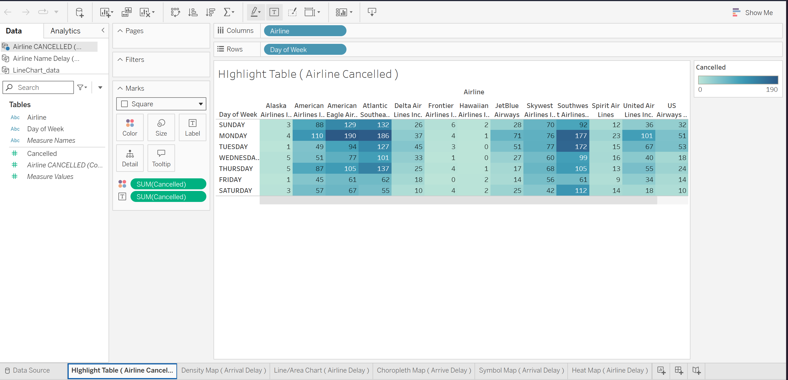
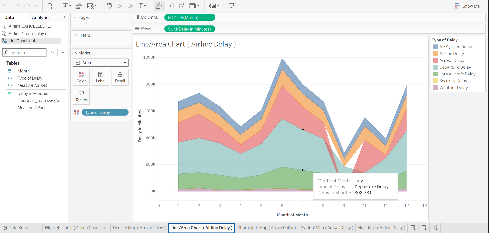
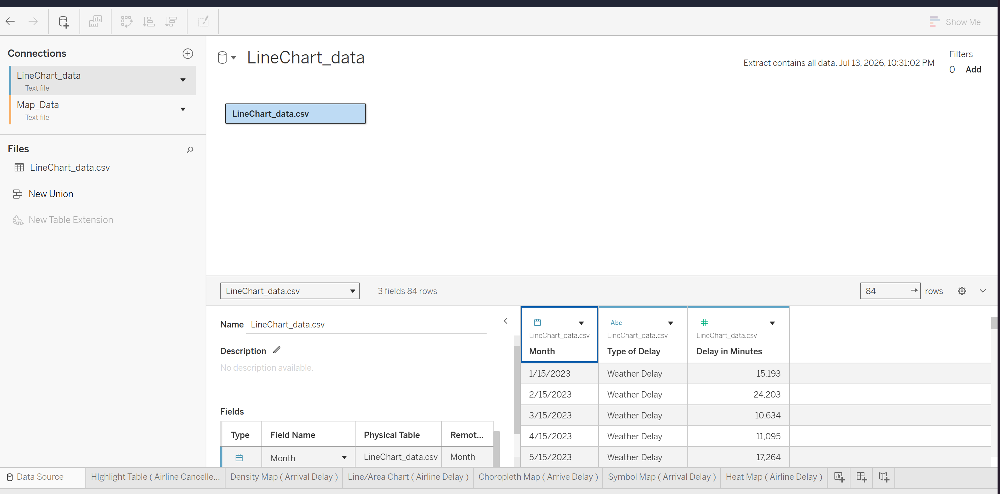

# Data Visualization with Flight Dataset (Tableau)

A multi-sheet Tableau workbook analyzing US flight data — covering 
cancellations, delays, and delay causes across airlines, days of the 
week, and time of year using six different visualization types.

## 🔗 Live Interactive Dashboard
[View on Tableau Public](https://public.tableau.com/app/profile/kaung.khant.han/viz/DataVisualizationwithFlightDataset/HeatMapAirlineDelay)

## 📊 Preview

## 🛠 Tools & Techniques Used
- **Tableau Desktop / Tableau Public**
- **Multiple data connections**: connected and managed two separate 
  data sources (`LineChart_data.csv` and `Map_Data`) within a single 
  workbook, switching between sources per sheet as needed
- **Highlight table**: color-intensity table of cancelled flights by 
  airline and day of week
- **Area chart**: stacked area chart breaking down total delay minutes 
  by month across 7 delay categories (Air System, Airline, Arrival, 
  Departure, Late Aircraft, Security, Weather)
- **Treemap / Heat map**: airline-level comparison of total delay 
  minutes, sized and colored by magnitude
- **Density map, choropleth map, and symbol map**: geographic views 
  of arrival delay data

## 📌 Sheet Breakdown
- **Highlight Table (Airline Cancelled)**: cancellations by airline 
  and day of week, color-coded by volume
- **Density Map (Arrival Delay)**: geographic density of arrival delays
- **Line/Area Chart (Airline Delay)**: monthly trend of delay minutes 
  broken down by delay type
- **Choropleth Map (Arrive Delay)**: state/region-level arrival delay 
  totals
- **Symbol Map (Arrival Delay)**: point-based geographic delay view
- **Heat Map (Airline Delay)**: treemap comparing total delay minutes 
  by airline

## 🔧 Skills Demonstrated
- Customizing and managing multiple data source connections within 
  one workbook
- Switching/reassigning data sources per sheet
- Building diverse chart types (highlight tables, area charts, 
  treemaps, and 3 map types) from a single dataset

## 📂 Dataset
Feel free to use the dataset in this repo for your own practice or projects.
